# LiTime Dual BMS + Victron MPPT Monitor

Real-time display + MQTT bridge for **two LiTime 48V 100Ah Smart ComFlex** batteries
**and** a **Victron MPPT solar charge controller**, plus a companion desktop
dashboard app.

- **Seeed Studio XIAO ESP32-S3** (dual-core, BLE + WiFi) running the firmware
- **Waveshare 2.4" ILI9341 LCD** (240×320, SPI) — *optional* physical display (see note below)
- **Local MQTT broker** (Mosquitto / Home Assistant) as the data bus
- **PyQt5 desktop dashboard** (`litime_monitor.py`) with live charts, history, and event logging

> ### 🖥️ The LCD display is optional
> Every value shown on the physical screen is also published over MQTT and
> shown live in the desktop dashboard and Home Assistant. If you don't wire
> up the Waveshare ILI9341 panel, the ESP32-S3 firmware still runs and
> functions completely normally (BLE polling, Victron decoding, MQTT
> publishing, HA discovery) — the display code simply has nothing physically
> attached to draw to. Skip the **Hardware Wiring** section entirely if you
> only plan to monitor via MQTT / the desktop app / Home Assistant.

> ### 🤖 About this project
> This entire application — the ESP32-S3 firmware, the display UI, the MQTT
> bridge, the Victron BLE decryption/decoding, and the full PyQt5 desktop
> dashboard — was designed and written by **GitHub Copilot (Claude Sonnet 5)**
> working interactively with the repo owner inside VS Code. Every file in this
> repository is AI-generated code, iterated on through a conversational
> development process.

---

## Screenshots

### Physical LCD (Waveshare 2.4" ILI9341)

| Overview | Battery 1 | Battery 2 |
|---|---|---|
| 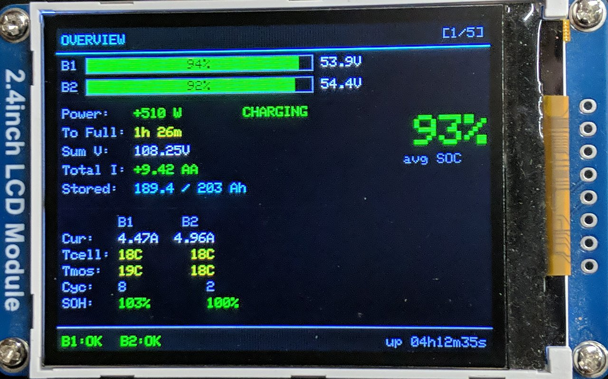 | 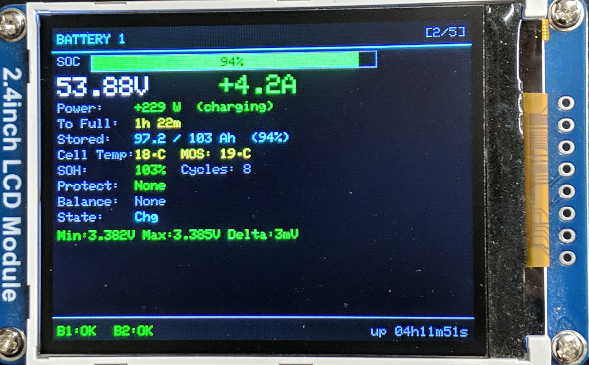 | 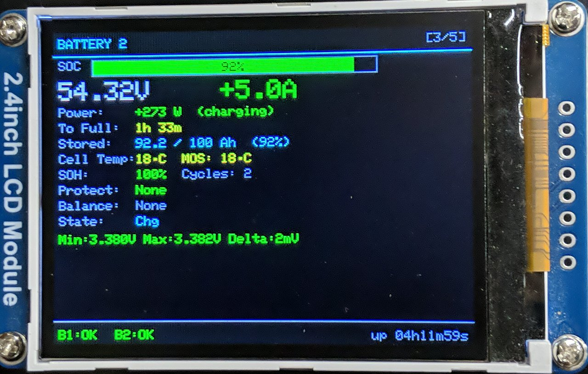 |

| Cell Voltages | MPPT |
|---|---|
| 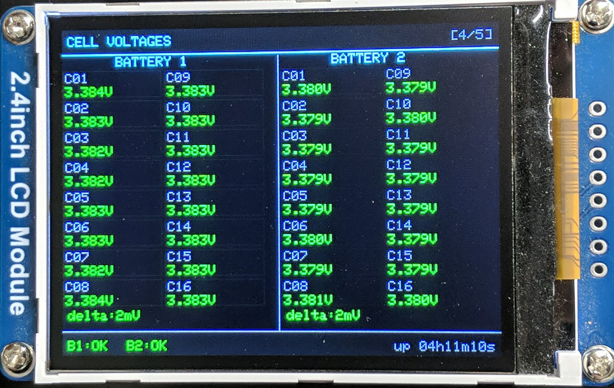 | 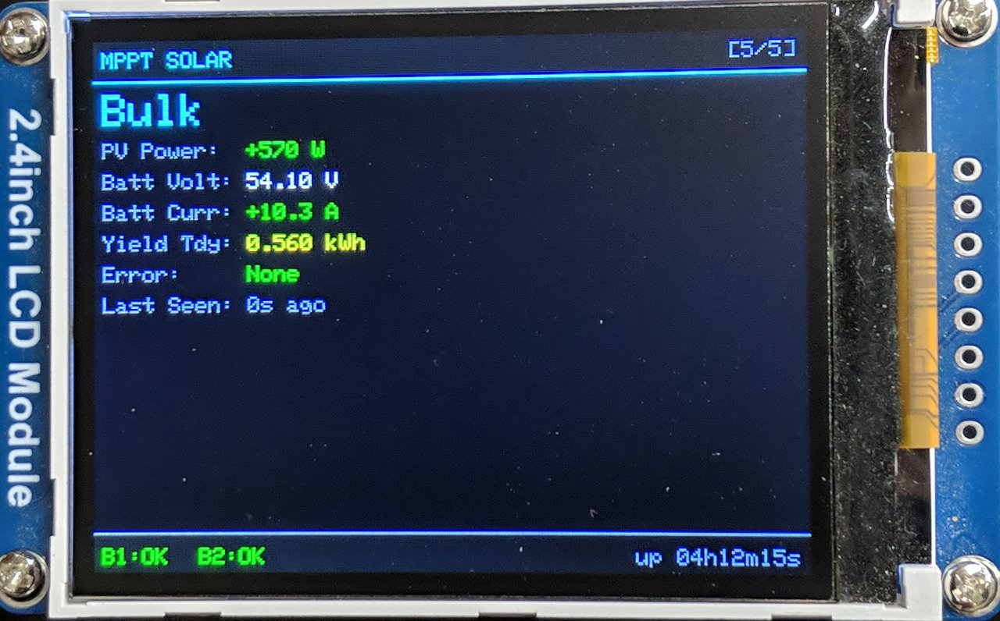 |

### Desktop Dashboard

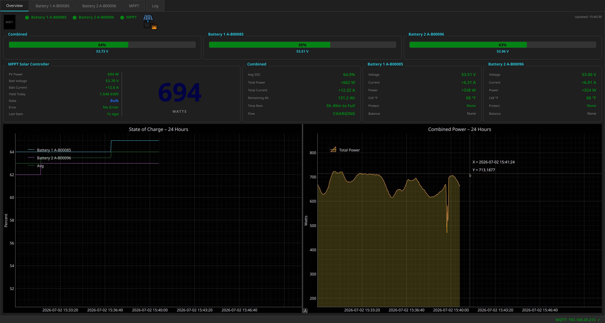

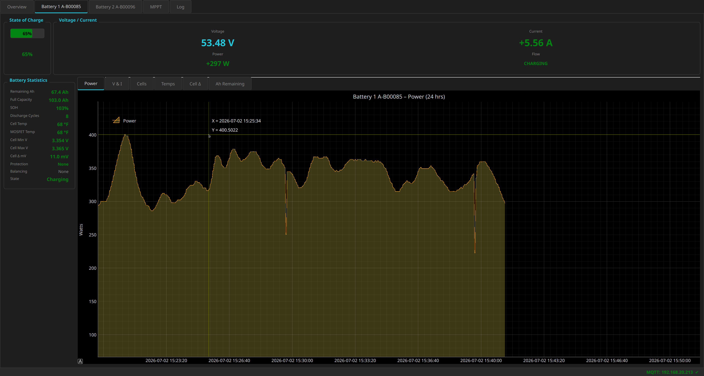

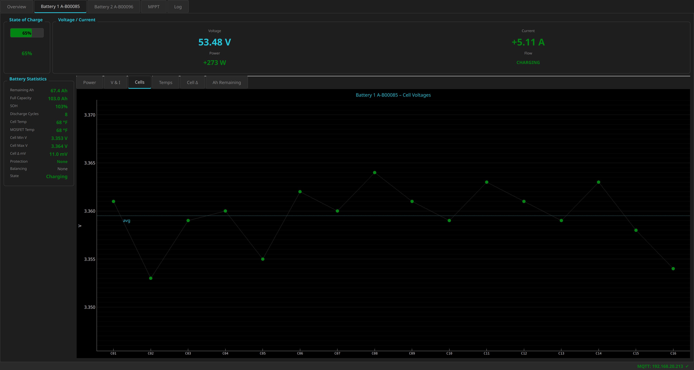

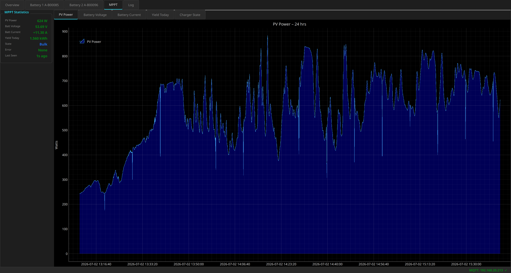

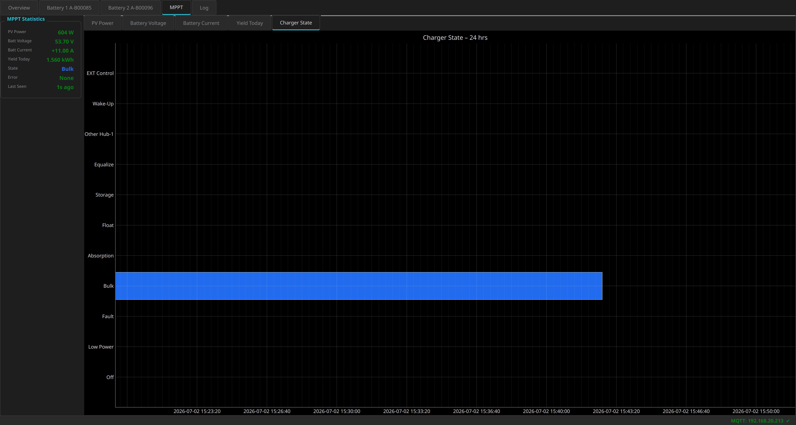

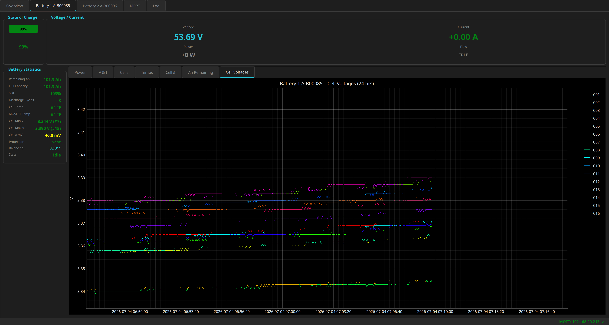

---

## Features

| Feature | Detail |
|---|---|
| BLE polling | Both LiTime batteries polled every 2 s (alternating) |
| Victron MPPT | Passive BLE advertising scan — decrypts Victron's encrypted "Extra Manufacturer Data" broadcast, no pairing/connection required |
| SOC display | Large color-coded bars, on both the physical LCD (optional) and the desktop app |
| Live data | Voltage · Current · Power · Cell temps · MOSFET temp · PV power · Yield |
| Cell voltages | Full grid per battery, min/max/delta highlighted |
| Estimated time | Time-to-full (charging) / time-to-10%-reserve (discharging) — see note below |
| Auto-page cycle | LCD rotates through 5 screens automatically; desktop app has tabs |
| Manual advance | Press **BOOT** button (GPIO0) on XIAO to advance the LCD page |
| MQTT JSON | Full JSON payload per device + flat convenience topics |
| HA discovery | Auto-creates entities in Home Assistant via MQTT discovery |
| Watchdog | 60 s hardware WDT recovers the ESP32 from BLE/WiFi hangs |
| Desktop dashboard | 24-hour live charts (PyQt5 + pyqtgraph/pglive), event log, dark theme |

> **Note on "Time Remaining":** the discharge estimate targets a **10% SOC
> reserve**, not literal 0%. LiFePO4 packs shouldn't routinely be run past
> that point, and the BMS's voltage-based low-cutoff can trip before true 0%
> Ah is reached anyway. This threshold is configurable via `SOC_RESERVE_PCT`
> in `config.h`. "Time to full" while charging is unaffected and still
> targets 100%.

> **Note on PV Voltage:** the Victron BLE advertising broadcast used by this
> project does not include a PV (solar array) voltage field — only PV power,
> battery voltage/current, yield, state and error are broadcast.

---

## Intended Use: Supplementing an Anker SOLIX F3800 Plus

This whole battery + MPPT monitoring rig exists to support a specific
real-world setup: the two LiTime 48V batteries (kept topped up by the
Victron MPPT/solar array) are wired into the **two solar (PV) input ports**
of an **Anker SOLIX F3800 Plus**, delivering roughly **53V DC at up to 17A —
about 1800W combined**. As far as the F3800 is concerned, this looks like a
(very well-behaved) solar array, since it's within its accepted PV
voltage/current window.

The F3800 already supports up to 1800W recharge from an AC wall outlet, so
raw charge speed isn't the point — the real advantage is that **plugging
into AC wall power disables the F3800's 240VAC output**, while its solar
(PV) input does not. Feeding it through the PV ports instead means you can
recharge the unit at the same ~1800W rate while it's still actively
outputting 240VAC — something the F3800's built-in AC charger can't do.

> **Power outage backup path:** this also works without any sun. If solar
> isn't available (e.g. an extended outage), the two LiTime batteries can
> instead be topped up by an ordinary 120V AC battery charger — run from a
> portable generator — connected directly to the batteries. The F3800 keeps
> drawing from them through its PV ports exactly as before, so you're
> effectively recharging the whole system from 120V generator power while
> the F3800 continues to output 240VAC the entire time.

> **This project does not talk to the F3800 in any way.** There is no local
> API/BLE/serial link available for the F3800 Plus (unlike the Solarbank/Smart
> Plug/Smart Meter line, which Anker's official Home Assistant integration
> supports via local Modbus TCP). This repo's ESP32 + dashboard only monitor
> the LiTime batteries and Victron MPPT feeding into it — the F3800's own SOC,
> input/output power, etc. are only visible in the Anker app.

If you're replicating this setup:

- **No external current limiting is needed.** The F3800's solar (PV) input
  acts as its own charge controller — it draws current on its own terms (up
  to ~17A per port) rather than the battery bank "pushing" current into it,
  so there's no MPPT-style current-limiting curve to replicate on the
  battery side.
- **Match polarity and voltage window carefully.** These LiTime packs are
  16S LiFePO4 (nominal 51.2V, resting/charged in the ~53-58V range), which
  needs to stay inside whatever PV input voltage range the F3800 documents
  for its solar ports — going over (or under) that window can cause it to
  reject the input entirely rather than throttle.
- Split the ~1800W combined draw across both PV ports rather than one, per
  Anker's per-port PV input rating.
- This is a manual/passive DC connection, not a communicating "smart"
  integration — the LiTime/Victron monitoring this project provides is what
  lets you keep an eye on the source batteries (SOC, current draw, temps)
  while they feed the F3800, without needing the F3800 itself to report
  anything back.

---

## Repository Layout

```
LiTime_BMS_Display.ino     Main Arduino sketch (setup/loop)
LiTime_BMS_Display.h       Shared BatteryData / VictronData structs
config.h                   ★ All user configuration lives here (WiFi, MQTT, BLE MACs, Victron key)
display_manager.cpp/.h     ILI9341 LCD rendering
mqtt_manager.cpp/.h        MQTT publishing
victron_mppt.cpp/.h        Victron BLE passive scan, AES-CTR decrypt, decode

litime_monitor.py          PyQt5 desktop dashboard (reads MQTT, live charts)
shared_config.py           Lets the desktop app read settings straight out of config.h
requirements.txt           Python dependencies for the desktop app
icon.jpg                   App icon/logo (used in the desktop dashboard)
images/                    Screenshots used in this README
```

---

## Hardware Wiring

> **This entire section is optional.** The firmware runs fine with nothing
> wired to the display pins — you'll just have no physical screen output.
> All data is still available via MQTT, the desktop dashboard, and Home
> Assistant. Only follow this section if you want the physical LCD readout.

### XIAO ESP32-S3 → Waveshare 2.4" ILI9341

```
Waveshare Pin    XIAO ESP32-S3 Pin    Note
─────────────────────────────────────────────────────
VCC              3V3
GND              GND
DIN              D9  (GPIO8)          SPI MOSI (data in)
CLK              D8  (GPIO7)          SPI Clock
CS               D2  (GPIO3)          Chip select
DC               D3  (GPIO4)          Data/Command
RST              D1  (GPIO2)          Display reset
BL               5V (XIAO VBUS/5V)    3V3 already used for VCC; module is rated
                                      3.3V/5V and BL only enables the on-board
                                      backlight driver (not a direct LED pin)
```

**Schematic (ASCII):**
```
XIAO ESP32-S3
┌────────────────┐
│ 3V3 ───────────┼─── VCC  (Waveshare)
│ GND ───────────┼─── GND
│ 5V  ───────────┼─── BL   (backlight; module is rated 3.3V/5V)
│ D1/GPIO2 ──────┼─── RST
│ D2/GPIO3 ──────┼─── CS
│ D3/GPIO4 ──────┼─── DC
│ D8/GPIO7 ──────┼─── CLK
│ D9/GPIO8 ──────┼─── DIN
└────────────────┘
```

### Power Supply
- Power the XIAO via its USB-C port or BAT pin (3.6–4.2V LiPo)
- The LiTime batteries and Victron MPPT are **NOT** electrically connected to
  the XIAO — all communication is wireless (BLE)

---

## Software Setup (ESP32-S3 Firmware)

### 1. Install Board Support
In Arduino IDE → **File → Preferences → Additional Board Manager URLs**:
```
https://files.seeedstudio.com/arduino/package_seeeduino_boards_index.json
```
Then **Board Manager** → install **"Seeed XIAO ESP32S3"**.

Select board: **XIAO_ESP32S3**

### 2. Install Libraries
Open **Library Manager** (Ctrl+Shift+I) and install:

| Library Name | Author | Used for |
|---|---|---|
| **BMS Client** | mirosieber (Litime_BMS_ESP32) | LiTime BLE protocol |
| Adafruit ILI9341 | Adafruit | LCD driver |
| Adafruit GFX Library | Adafruit | LCD graphics |
| PubSubClient | Nick O'Leary | MQTT client |
| ArduinoJson | Benoit Blanchon (v7+) | JSON payloads |
| **wolfssl** | wolfSSL Inc. | AES-128-CTR decryption of Victron BLE data |

### 3. Configuration
Edit **`config.h`** before flashing — this is the single file with every
user-specific setting (WiFi, MQTT, battery MACs, Victron MPPT MAC/key).

```cpp
// WiFi
#define WIFI_SSID      "YourSSID"
#define WIFI_PASSWORD  "YourPassword"

// MQTT broker IP
#define MQTT_BROKER    "192.168.1.100"

// LiTime BLE MAC addresses (see "Finding BLE MAC Addresses" below)
#define BMS1_MAC       "AA:BB:CC:DD:EE:01"
#define BMS2_MAC       "AA:BB:CC:DD:EE:02"
```

### 4. Compile & Flash
```
Board:         XIAO_ESP32S3
Upload Speed:  921600
Flash Size:    4MB (32Mb)
Partition:     Default (3MB APP)
```
Press **Upload** (the board auto-enters bootloader).

---

## Victron MPPT Setup (important — read this section)

This project reads your Victron MPPT solar charge controller **passively**,
over its normal Bluetooth *advertising* broadcast — the same encrypted data
the VictronConnect app reads. No pairing or BLE connection is made to the
controller; the ESP32 just listens.

Credit: the BLE advertising protocol, AES-CTR decryption approach, and byte
layout used here are based on the excellent work in
**[chrisj7903/Read-Victron-advertised-data](https://github.com/chrisj7903/Read-Victron-advertised-data)**
(MIT licensed).

### Step 1 — Enable Instant Readout on the controller
1. Open the **VictronConnect** app and connect to your MPPT once (Bluetooth).
2. Go to **Settings (⋮) → Product Info**.
3. Make sure **Instant Readout** is enabled (it broadcasts data over BLE
   advertising even when nothing is actively connected — this is what makes
   passive reading possible).

### Step 2 — Get the 32-character Encryption Key
1. Still in **Settings (⋮) → Product Info**, scroll down to **Encryption Key**.
2. ⚠️ **Known VictronConnect UI bug:** tapping the key field may only show
   31 of the 32 hex characters on-screen. Don't copy it by hand — instead
   tap the key, then use the **copy / share** dialogue that pops up to
   capture the full, correct 32-character string.
3. Convert the 32-character hex string into 16 bytes for `config.h`. For
   example, key string `0011223344556677 8899aabbccddeeff` becomes:
   ```cpp
   const uint8_t VICTRON_MPPT_KEY[16] = {
       0x00,0x11,0x22,0x33,0x44,0x55,0x66,0x77,
       0x88,0x99,0xaa,0xbb,0xcc,0xdd,0xee,0xff
   };
   ```

### Step 3 — Get the controller's BLE MAC address
Use the free **nRF Connect** app (Nordic Semiconductor, iOS/Android) — this
is the easiest method:
1. Open nRF Connect → tap **Scan**.
2. Find your MPPT in the list (it advertises using the name you set in
   VictronConnect, e.g. "SmartSolar MPPT 100/30").
3. Tap it to view details — the MAC address is shown at the top (Android).
   On iOS, Apple hides real BLE MAC addresses from apps; use an Android
   device, or fall back to the ESP32 scan sketch in
   [Finding BLE MAC Addresses](#finding-ble-mac-addresses-litime--victron)
   below and match by RSSI/proximity or manufacturer data instead.

### Step 4 — Fill in `config.h`
```cpp
#define VICTRON_MPPT_NAME     "My Solar Controller"   // cosmetic only
#define VICTRON_MPPT_ADDRESS  "aa:bb:cc:dd:ee:ff"      // lower-case, from Step 3
const uint8_t VICTRON_MPPT_KEY[16] = { /* from Step 2 */ };
```

### How it works (for the curious)
`victron_mppt.cpp` runs a repeating passive BLE scan looking for any
advertisement carrying Victron's company ID (`0x02E1`). For the packet
matching `VICTRON_MPPT_ADDRESS`, it:
1. Extracts the 2-byte IV (nonce) and the encrypted payload from the
   manufacturer-data bytes.
2. Decrypts the payload with **AES-128-CTR** (via wolfSSL) using your key.
3. Decodes the 16 decrypted bytes into device state, error code, battery
   voltage/current, PV power, and yield-today — all per Victron's published
   "Extra Manufacturer Data" bit layout.

If the MPPT is out of range or fails to decode, the MPPT screen/tab simply
shows "not available" — nothing else in the firmware or dashboard is
affected.

---

## Finding BLE MAC Addresses (LiTime + Victron)

**Easiest method — nRF Connect app** (Nordic Semiconductor, free, iOS/Android):
1. Open the app → tap **Scan**.
2. Look for your LiTime battery (name usually contains "LT" or similar) or
   your Victron device (its VictronConnect name).
3. Tap the device to see its MAC address at the top of the detail screen.
4. Android shows a real MAC; iOS shows a random per-app UUID instead due to
   OS restrictions — use Android, or the sketch below, for iOS.
5. Power-cycle or bring the phone close to each battery individually to be
   sure which MAC belongs to which physical unit.

**Alternative — quick ESP32 scan sketch** (paste into a blank `.ino`):
```cpp
#include <BLEDevice.h>
#include <BLEScan.h>
BLEScan* pScan;
void setup() {
    Serial.begin(115200);
    BLEDevice::init("");
    pScan = BLEDevice::getScan();
    pScan->setActiveScan(true);
    BLEScanResults results = pScan->start(10);
    for (int i = 0; i < results.getCount(); i++) {
        BLEAdvertisedDevice d = results.getDevice(i);
        Serial.printf("%s  %s  RSSI:%d\n",
            d.getAddress().toString().c_str(),
            d.getName().c_str(), d.getRSSI());
    }
}
void loop() {}
```

---

## Desktop Dashboard (`litime_monitor.py`)

A PyQt5 dark-theme desktop app that subscribes to the same MQTT topics the
firmware publishes, showing live values plus 24-hour rolling charts.

> ### 📈 Powered by pglive
> The smooth, genuinely real-time charts throughout this dashboard (Power,
> Voltage & Current, Cell voltages, Temperatures, Cell Delta, Ah Remaining,
> PV Power, Yield, and the Charger State timeline) are all built on
> **[pglive](https://github.com/domarm-comat/pglive)**, layered on top of
> **[pyqtgraph](https://github.com/pyqtgraph/pyqtgraph)**. pglive's
> `DataConnector` model made it trivial to get thread-safe, continuously
> scrolling 24-hour rolling charts with crosshairs, live tooltips, and zero
> flicker — updating every 2 seconds without any manual redraw/repaint
> bookkeeping. Genuinely one of the best live-charting experiences available
> for PyQt, and this dashboard would look far less polished without it.

### Install
```bash
python3 -m venv venv
source venv/bin/activate        # Windows: venv\Scripts\activate
pip install -r requirements.txt
```

Dependencies (`requirements.txt`): `PyQt5`, `pyqtgraph`, `pglive`, `paho-mqtt`.

### Configure
The dashboard reads its MQTT broker address, port, credentials, and battery
names directly out of the firmware's `config.h` (via `shared_config.py`) —
**edit `config.h` once and both the firmware and the desktop app pick it
up**. No separate Python config file needed. If `config.h` can't be found or
parsed, the app falls back to safe defaults and prints a warning.

### Run
```bash
python3 litime_monitor.py
```

### Tabs
- **Overview** — combined SOC bars, power flow, per-battery summary, MPPT summary strip
- **Battery 1 / Battery 2** — big V/I/P readout, full statistics panel, 6 inner chart tabs (Power, V&I, Cells, Temps, Cell Δ, Ah Remaining)
- **MPPT** — MPPT statistics panel (mirrors the battery stats panel) + inner chart tabs (PV Power, Battery Voltage, Battery Current, Yield Today, Charger State)
- **Log** — running event/timestamped log of state changes and periodic summaries

---

## MQTT Topics

### Per-battery JSON state
```
litime/battery1/state     { full JSON object }
litime/battery2/state     { full JSON object }
```

**Example payload:**
```json
{
  "connected": true,
  "soc": 78,
  "soh": "99%",
  "total_voltage": 52.346,
  "current": 12.500,
  "power": 654.3,
  "cell_temp": 27,
  "mosfet_temp": 31,
  "remaining_ah": 78.00,
  "full_capacity_ah": 100.00,
  "discharge_cycles": 12,
  "time_remaining_s": 22464,
  "time_direction": "to_full",
  "cell_voltages": [3.272, 3.271, 3.270, "..."],
  "cell_min_v": 3.270,
  "cell_max_v": 3.274,
  "cell_delta_mv": 4.0
}
```

### Flat convenience topics
```
litime/battery1/soc
litime/battery1/voltage
litime/battery1/current
litime/battery1/power
litime/battery1/cells/cell01 … cell16
```

### Combined totals
```
litime/combined/state     { soc_avg, total_power, total_current,
                            total_remaining_ah, time_remaining_s,
                            time_direction, flow }
```

### Victron MPPT
```
victron/state              { full JSON: valid, state, state_str, error,
                             error_str, batt_v, batt_a, pv_w, yield_today,
                             last_seen_s }
victron/state_str
victron/batt_v
victron/batt_a
victron/pv_w
victron/yield_today
```

### Status / LWT
```
litime/status              "online" / "offline"
```

---

## Home Assistant Integration

All Home Assistant entities for this project come from **one MQTT package
file** — the firmware itself does **not** use MQTT discovery. (An earlier
version did auto-discover a handful of core sensors, but keeping two
overlapping sources of truth caused duplicate/inconsistent entities once the
YAML package below was added, so firmware-side discovery was removed
entirely in favor of a single, complete, well-organized source.)

### Full MQTT sensor coverage (YAML package)

A ready-to-use Home Assistant **package** file covering every single topic
this project publishes is provided at
[`homeassistant/mqtt_sensors.yaml`](homeassistant/mqtt_sensors.yaml),
including:

- Per battery: voltage, current, power, SOC, cell/MOSFET temp, remaining Ah,
  full capacity, SOH, discharge cycles, cell min/max/delta voltage, all 16
  individual cell voltages, human-readable protection/balancing/state/heat
  text, direction, and a friendly "3h 43m to Reserve" time-remaining sensor
- The entire Victron MPPT (charger state, error, battery V/A, PV power,
  yield today) — the firmware has no native discovery for this at all
- True system-wide combined values (average SOC, total power/current/
  remaining Ah/capacity, flow direction, time remaining) — **not** a
  per-battery duplicate; each battery's own values live on its own device

**Install:**
1. Enable packages in `configuration.yaml` (skip if already enabled):
   ```yaml
   homeassistant:
     packages: !include_dir_named packages
   ```
2. Copy [`homeassistant/mqtt_sensors.yaml`](homeassistant/mqtt_sensors.yaml)
   into `<ha-config>/packages/litime_victron_mqtt.yaml`.
3. If you changed `MQTT_TOPIC_BASE` / `MQTT_VICTRON_TOPIC_BASE` from the
   defaults (`litime` / `victron`) in `config.h`, update the topic strings
   in the copied file to match.
4. **Developer Tools → YAML → Check Configuration**, then **Restart**.

This creates four devices — **LiTime Battery 1**, **LiTime Battery 2**,
**LiTime System** (combined/system-wide values), and **Victron MPPT** — with
an entity for every field published over MQTT. No firmware reflash is
required to use it; it reads the raw MQTT topics directly.

---

## BLE Protocol Reference — LiTime BMS

The firmware uses the **BMSClient** library
([mirosieber/Litime_BMS_ESP32](https://github.com/mirosieber/Litime_BMS_ESP32)),
which implements:

| Item | Value |
|---|---|
| Service UUID | `0000FFE0-0000-1000-8000-00805F9B34FB` |
| Write UUID (command) | `0000FFE2-0000-1000-8000-00805F9B34FB` |
| Notify UUID (data) | `0000FFE1-0000-1000-8000-00805F9B34FB` |
| Query command | `00 00 04 01 13 55 AA 17` |
| Response length | 104 bytes |

Key byte offsets in the 104-byte response:

| Field | Bytes | Scale |
|---|---|---|
| Total voltage | [8..11] | ÷ 1000 → V |
| Cell voltage sum | [12..15] | ÷ 1000 → V |
| Cell voltages | [16..47] | 2 bytes each ÷ 1000 → V |
| Current | [48..51] | ÷ 1000 → A (signed) |
| Cell temp | [52..53] | °C (signed) |
| MOSFET temp | [54..55] | °C (signed) |
| Remaining Ah | [62..63] | ÷ 100 → Ah |
| Full capacity Ah | [64..65] | ÷ 100 → Ah |
| SOC | [90..91] | % |
| SOH | [92..95] | % |
| Discharge cycles | [96..99] | count |

---

## Troubleshooting

| Symptom | Fix |
|---|---|
| "BLE: FAILED" on boot | Check MAC address in config.h; ensure battery is powered on; move closer |
| Only one battery connects | BLE on ESP32 supports multiple connections but range/interference matters; try staggered `init()` with a delay |
| Display blank / white | Check SPI wiring; verify TFT_CS, TFT_DC, TFT_RST pin assignments |
| MQTT not connecting | Verify broker IP; check firewall; test with `mosquitto_sub -t '#'` |
| Wrong cell count | 48V 16S battery → 16 cells; if you see <16, some cells may read 0V and are skipped by the library |
| Watchdog reset | Battery BLE response stalled; the 60 s WDT will auto-reboot the ESP32 |
| MPPT never decodes | Confirm Instant Readout is enabled in VictronConnect, MAC address is correct, and the 32-char key was captured via copy/share (not typed by hand) |
| MPPT "Yield Today" doesn't reset at midnight | This is normal Victron firmware behavior in locations with very long daylight / no true dark period — the MPPT has no RTC and relies on a full day/night voltage cycle to reset the counter. Not a bug in this project. |
| Desktop app can't find config.h | Run `litime_monitor.py` from the repo folder, or check the warning printed to stderr for the path it tried |

---

## Credits

This project builds directly on the work of:

- **[chrisj7903/Read-Victron-advertised-data](https://github.com/chrisj7903/Read-Victron-advertised-data)**
  (MIT) — Victron BLE advertising protocol research, AES-CTR decryption
  approach, and Solar Charger byte-field layout that `victron_mppt.cpp` is
  based on.
- **[mirosieber/Litime_BMS_ESP32](https://github.com/mirosieber/Litime_BMS_ESP32)**
  — the `BMSClient` Arduino library used to read the LiTime batteries over BLE.
- **[pglive](https://github.com/domarm-comat/pglive)** — the real-time charting
  layer behind every live chart in the desktop dashboard. Its `DataConnector`
  API made smooth, thread-safe, continuously scrolling live plots almost
  trivial to implement — genuinely excellent library.
- **[pyqtgraph](https://github.com/pyqtgraph/pyqtgraph)** — the fast
  scientific plotting library that pglive itself is built on top of.

## License
MIT — based on [mirosieber/Litime_BMS_ESP32](https://github.com/mirosieber/Litime_BMS_ESP32)
and [chrisj7903/Read-Victron-advertised-data](https://github.com/chrisj7903/Read-Victron-advertised-data).
